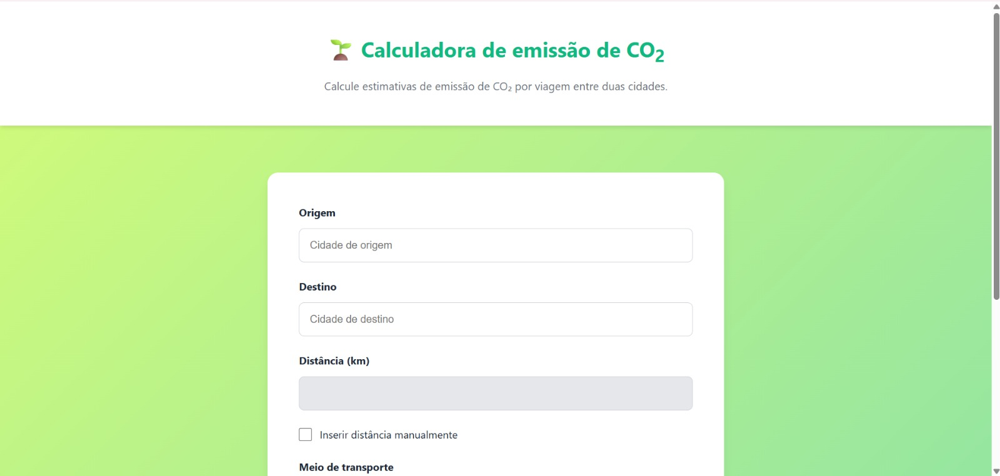
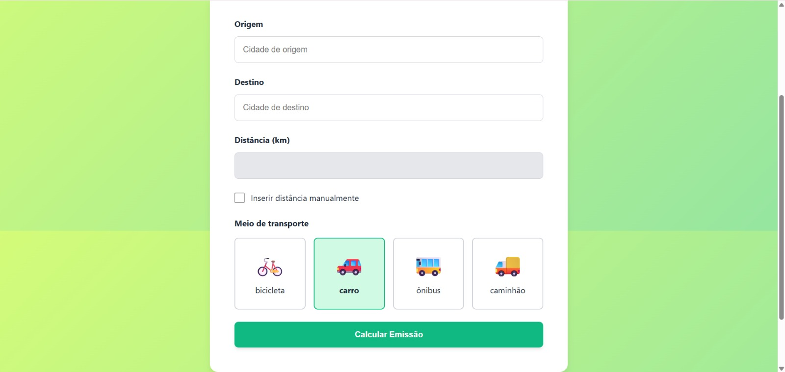

# 🌱 Calculadora de Emissão de CO₂

Este projeto permite calcular a emissão de dióxido de carbono (CO₂) com base em uma viagem entre duas cidades brasileiras e o meio de transporte utilizado.

## 🚀 Resumo

A calculadora recebe:
- Cidade de origem
- Cidade de destino
- Meio de transporte (bicicleta, carro, ônibus ou caminhão)

Com base nesses dados, ela:
- Calcula a distância entre as cidades
- Estima a quantidade de CO₂ emitido
- Compara os resultados entre diferentes meios de transporte
- Calcula os créditos de carbono necessários para compensar a emissão
- Estima o valor em reais para compensação

## 📸 Imagens do projeto

-Tela inicial da calculadora

---
---

-Formulário de entrada de dados

---
---

-Resultado da emissão calculada

---
---

-Comparação entre os meios de transporte

---
---

-Sessão de créditos de carbono e rodapé

---
---

## 🌐 Site

Acesse o projeto online:  
**[https://wellingthonschuh.github.io/CalculadoraCO2/](https://wellingthonschuh.github.io/CalculadoraCO2/)**

---

Desenvolvido com ❤️ por Wellingthon Schuh | Projeto Github Copilot
